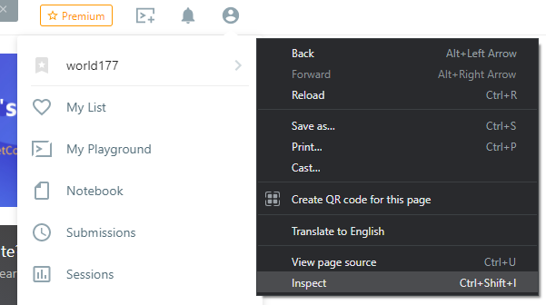
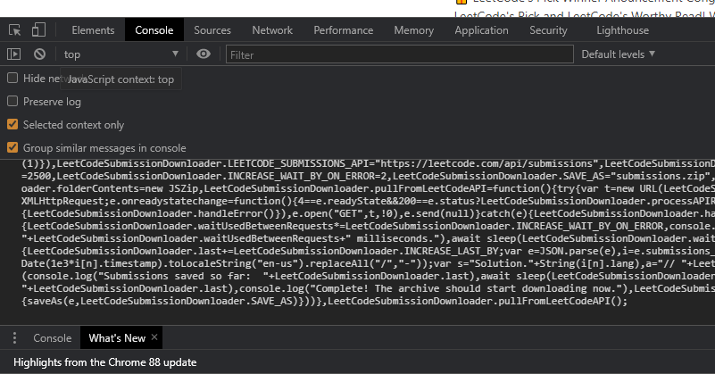
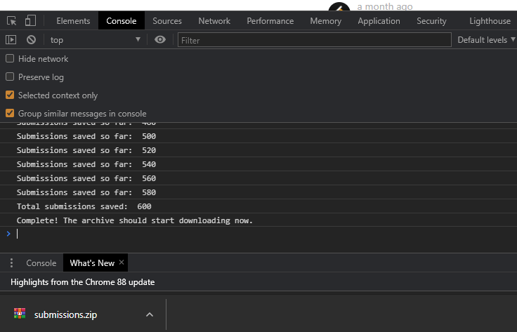
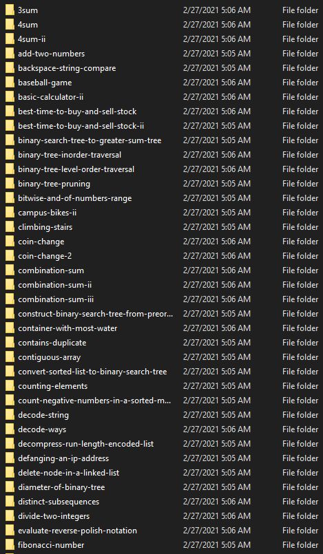
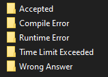
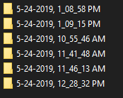
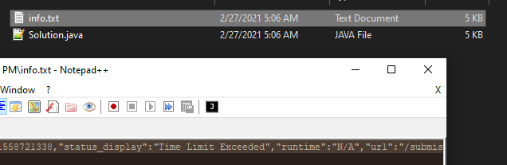

# LeetCode Submission Downloader

**This is a program that is intended to be ran in the console on leetcode.com**. I wanted to download all of my previous submissions for LeetCode, however, all of the different programs available (that I found) required installing and running different programs. After using several broken methods, I felt like this was really overcomplicated, especially since LeetCode has an easily accesible API and many others were often using the web driver for Chrome instead of something simple like this. (with account logins or cookies needing to be provided)

# Setup for use

Login to LeetCode, then right click and click "inspect."

Click on the console tab, copy and paste [this entire file](js/LeetCodeDownloader.min.js), then press enter.

It will then start using the LeetCode API to save all of your previous submissions. Once it is finished, they will be added to a "submissions.zip" file that will be added to your downloads.

After extracting this file, there will be folders with all of the titles of the problems you have submitted solutions.

In each folder, there will be folders that indicate the final state of the the submissions.

In each of these folders, you'll see the time and date for each submission that ended in this state.

Inside a submission folder, you will find both the source code you submitted, and the json encoded API data related to that submission included in the info.txt file.

Hopefully this saves you from spending as much time as I did trying to download my submissions.

# Notes on the files included with this repository

There are two source code files, both within the **js** folder. 

- EasilyReadableLeetCodeDownloader.js
- LeetCodeDownloader.min.js

**EasilyReadableLeetCodeDownloader.js** is for you to review if you are worried about the safety of this file. It's written pretty simply so you can quickly review it if you want. The licenses in that file designate where I just copied and pasted the min.js files from [JSZip](https://github.com/Stuk/jszip/) and [FileSaver.js](https://github.com/eligrey/FileSaver.js/). You should be able to just copy and paste them again from their repositories if you want. 

You do not have to use the min.js file and can just copy and paste the entire file in the console if you make any changes. I usually like to quickly review stuff like this when it could potentially send my cookies for a website to an attacker - which is why I set it up like this.

**LeetCodeDownloader.min.js** is the same file as above, but ran through the js minifier found at https://jscompress.com. It was just included to make copy and pasting easier. (?, usually there isn't 1 js file, and multiple files need to be combined together to actually run it from the console. In this case it isn't **any** easier than just using the first file. Either way, both will work, and you're free to use whichever you prefer.)

# Licenses

- JSZip - The MIT License or GPL version 3
- FileSaver.js - The MIT License

